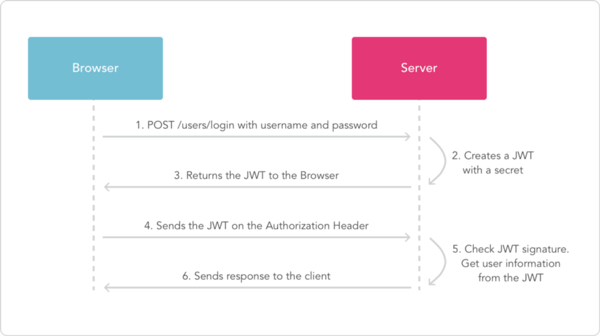

# JSON WEB token API with .NET CORE

JWT (Json Web Token) is an open standard (RFC 7519) that defines the Token format, defines the Token content, encrypts it, and provides lib for various languages.

### Introduction

- Authentication: Refers to verify **who you are**, so you need to use username and password for authentication.

- Authorization: Refers to **what you can do**, for example access, edit or delete permission and what happends after verification passes.

### Microservices authentication and authorization problems

+ Authentication and authorization logic needs to be handled in each microservice, and this part of the global logic needs to be implemented repeatedly in each microservice.

+ Microservices should follow the principle of single responsibility. A microservice only handles a single business logic. The global logic of authentication and authorization should not be placed in the microservice implementation.

+ HTTP is a stateless protocol. For the server, each time the user’s HTTP request is independent. Stateless means that the server can send client requests to any node in the cluster as needed. 

+ The authentication and authorization in the microservices architecture involves scenarios that are more complex, involving users accessing microservice applications, third-party applications accessing microservice applications.

### Client Token

The main difference between Token and Session is where the storage is different. The Token holds the user’s identity information, and each time the request is sent to the server, the server can therefore determine the identity of the visitor and determine whether it has access to the requested resource. The Token is used to indicate the user’s identity. Therefore, the content of the Token needs to be encrypted.

